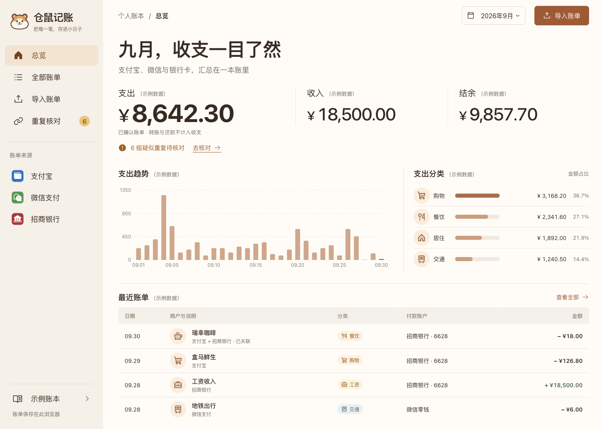

# 仓鼠记账 · Hamster Ledger

[](https://github.com/SakuraSM/hamster-ledger/actions/workflows/ci.yml)
[](LICENSE)

在 Web 和 Android 上记账、整理支付宝与银行流水、管理资产和预算。支持多账本、周期记账、日历和收支报表；两端共享账务规则。

> 项目处于早期开发阶段。当前提供 Web、Expo / React Native Android 工程和自托管同步服务。Android 可本地构建安装，尚未上架应用商店；没有银行直连。示例数据均为虚构。



## 主要功能

- 导入 CSV、XLSX、XLS，自动寻找表头并建议字段映射，支持查看样例、手动改列和确认推断结果。
- 区分支付平台与实际付款账户。重复文件和有明确流水号的同源重复自动识别，跨平台疑似重复交由用户核对。
- 自动归类常见商户，支持修改分类并保存规则。
- 按月汇总收支，按来源、分类和处理状态筛选，搜索商户或流水号。
- 使用整数分计算金额，退款抵扣支出，已识别的还款、充值、提现单列。
- 每条记录提供详情，展示原始流水、关联来源、分类与资产账户。
- 维护资产和负债账户，按余额基准与确认流水计算净资产，支持校准、归档及查看账户收支。
- 手动新增、编辑、删除和恢复账单；管理分类、标签与常用备注。
- 多账本、账单日历、自定义账期、月度及分类预算、日/周/月/年周期记账。
- 任意日期范围、全年收支、分类/标签饼图与每日趋势。
- 三种主题、首页金额隐藏；Web 支持前台提醒和离线 PWA，Android 支持系统通知。
- Web 支持本机密码加密；Android 使用 SQLCipher 与设备 Keystore。两端支持 Excel 导出、JSON 备份预览和恢复为新账本。
- 自托管账号与账本同步，发现冲突后保留两边数据。

当前仅支持人民币和单工作表 Excel。账单兼容性依据虚拟样本验证，不代表所有银行的所有导出版本都已适配。详细边界见 [能力说明](docs/capabilities.md)。

## 本地运行

需要 Node.js 22 或 24、npm 10 以上版本。

```sh
git clone https://github.com/SakuraSM/hamster-ledger.git
cd hamster-ledger
npm ci
npm run build
npm start
```

打开 http://127.0.0.1:4190 。首次进入登录页，可登录或选择“仅在本机使用”；在示例账本导入时写入“我的账本”，其他账本导入时写入当前账本。需要同步时，通过登录页注册或登录，再在“更多功能”中连接账本。服务器数据默认保存在 `data/ledger.sqlite`。开发页面可单独运行 `npm run dev -- --host 127.0.0.1 --port 4187 --strictPort`，该 Vite 服务不提供同步 API。

```sh
npm run check       # 类型、边界、测试、构建与静态托管打包
npm run build       # Web 产物位于 apps/web/dist/client
```

默认仅在当前浏览器保存。启用账号同步后才会上传账本；换设备后可登录并恢复云端账本，也可从 JSON 备份恢复。JSON 文件和服务端数据库包含明文账务数据，本机解锁密码只保护浏览器中的存储。自托管与备份方式见 [部署说明](docs/self-hosting.md)。

## Android 开发

需要 Android Studio / SDK 36、JDK 17 和已启动的模拟器或真机。使用原生构建，SQLCipher 不能在 Expo Go 中运行。

```sh
npm run android:run     # 生成原生工程、构建并安装开发版
npm run android:dev     # 后续启动 Metro
npm run android:export  # 验证 Android JavaScript 与资源打包
npm run android:apk     # 可独立安装的 arm64 APK，默认开发签名
```

详细构建、文件交互、认证与发布边界见 [Android 开发说明](docs/mobile-readiness.md)。Web 组件使用 Mantine，Android 使用 React Native Paper；共享暖色主题、图标和仓鼠标志。

## 项目目录

| 目录                           | 职责                                              |
| ------------------------------ | ------------------------------------------------- |
| `apps/server`                  | Node.js HTTP API、账号会话、SQLite 与静态页面服务 |
| `apps/mobile`                  | Expo、原生页面、SQLCipher、文件选择与分享         |
| `apps/web`                     | React 页面、浏览器文件读取、存储和导出            |
| `packages/ledger-core`         | 数据模型、分类、去重、收支计算与异步存储协议      |
| `packages/statement-importers` | 表头映射、日期金额解析、交易标准化                |
| `packages/design-tokens`       | Web 与 Android 的 JSON 设计变量                   |
| `packages/fixtures`            | 两端共用的虚拟演示账本                            |
| `packages/ledger-react`        | 注入平台适配器的共享 React 账本控制器             |
| `tests`                        | 账务行为、共享包契约和 Web 异步存储测试           |
| `docs`                         | 架构、设计依据、能力边界及 App 开发准备           |

业务包在不提供 DOM 类型的配置下独立编译；`ledger-react` 仅依赖 React 和共享协议，Web 与 Android 各自注入存储、时间及 ID 适配器。

- [鲨鱼记账能力对齐与验证范围](docs/shark-parity.md)
- [自托管部署](docs/self-hosting.md)
- [登录与认证策略](docs/authentication.md)
- [架构与依赖边界](docs/architecture.md)
- [资产账户与账单关联](docs/assets.md)
- [账单导入与手动调整](docs/importing.md)
- [Android 开发与验证](docs/mobile-readiness.md)
- [现代组件与 Android 方案](docs/adr/0002-modern-ui-and-android.md)
- [架构决策记录](docs/adr/0001-workspace-and-platform-boundaries.md)
- [设计与验证范围](docs/design/qa.md)

## 参与项目

欢迎提交可复现的问题和小范围改进。开始前阅读 [贡献说明](CONTRIBUTING.md)。请只提交虚拟样本，勿在 Issue、PR 或截图中包含真实账单、完整卡号或凭据。

安全漏洞通过 [私密报告入口](https://github.com/SakuraSM/hamster-ledger/security/advisories/new) 提交，详见 [安全策略](SECURITY.md)。

## 参考与许可

功能设计参考 [Bean-Sieve](https://github.com/Xm798/bean-sieve)、[Actual Budget](https://actualbudget.org/docs/api/reference/) 和 [double-entry-generator 社区讨论](https://github.com/deb-sig/double-entry-generator/discussions/162)。本项目自行实现当前范围内的规则，不声称拥有这些项目的全部能力。

代码采用 [MIT 许可证](LICENSE)。第三方依赖与资产说明见 [THIRD_PARTY_NOTICES.md](THIRD_PARTY_NOTICES.md)。
